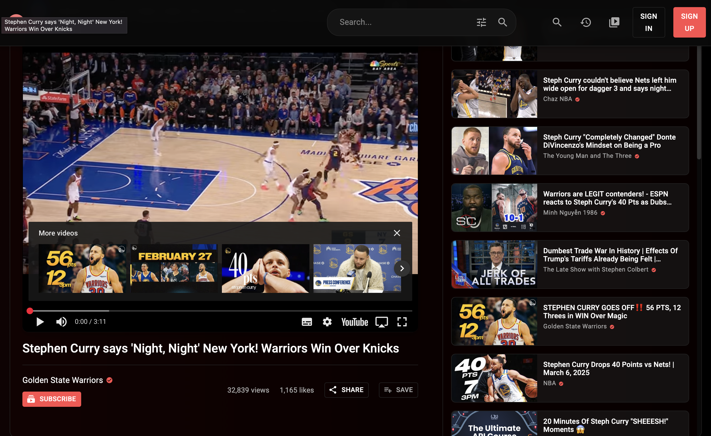

# BoxTube 🎥

BoxTube is a modern video streaming app inspired by youtube's ui built with Youtube's v3 api, React and Material-UI, offering a sleek dark theme interface and enhanced user experience features.




## 🌟 Features

### Core Features
- 🎨 Modern Dark Theme UI
- 🔍 Advanced Search with Filters
- 📱 Fully Responsive Design
- 🎵 Video Playback
- 📺 Channel Pages

### User Features
- 👤 User Authentication (Username-based)
- 📋 Custom Playlists
- ❤️ Favorites System
- ⏰ Watch Later
- 📝 Watch History
- 🔔 Channel Subscriptions

### Enhanced UX
- 💾 Local Storage for User Data
- 🎯 Smart Search Suggestions
- 📊 Advanced Search Filters
- ⚡ API Call Optimization

## 🚀 Getting Started

### Prerequisites
- Node.js (v14 or higher)
- npm or yarn
- YouTube Data API Key

### Link to site:
https://boxtube.netlify.app/

## 🛠️ Built With

- React.js
- Material-UI
- YouTube Data API v3
- React Router
- Context API for State Management

## 📦 Project Structure

```
src/
├── components/         # React components
│   ├── common/        # Shared components
│   ├── auth/          # Authentication components
│   └── ...
├── contexts/          # React Context providers
├── utils/            # Utility functions
├── styles/           # Global styles
└── App.js            # Main app component
```

## 🎨 Features in Detail

### Search System
- Real-time search suggestions
- Search history tracking
- Advanced filters (duration, upload date, quality)
- Debounced API calls

### Playlist Management
- Create custom playlists
- Add/remove videos
- Quick access to Watch Later and Favorites
- Playlist thumbnails and video count

### User Profile
- Watch history tracking
- Subscription management
- Profile customization
- Username-based authentication

### Video Player
- Custom video player interface
- Related videos suggestions
- Channel subscription integration
- Add to playlist functionality

## 📱 App Screenshots

| Home Page | Video Player |
|-----------|--------------|
|||

| Search Results | Channel Page |
|---------------|--------------|
|||

| Playlists | Profile |
|-----------|---------|
|||

